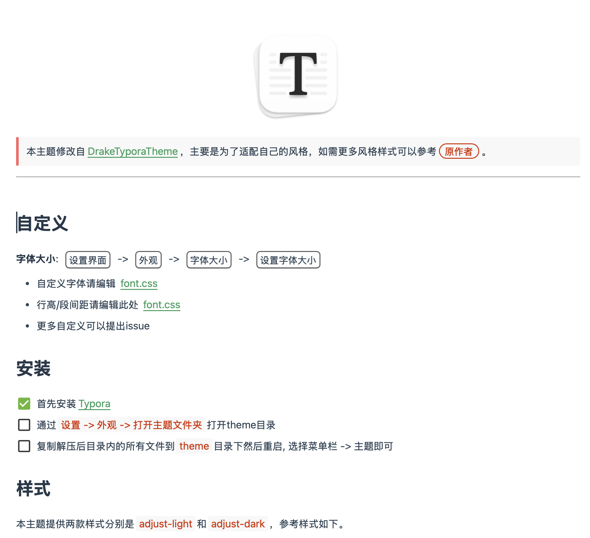
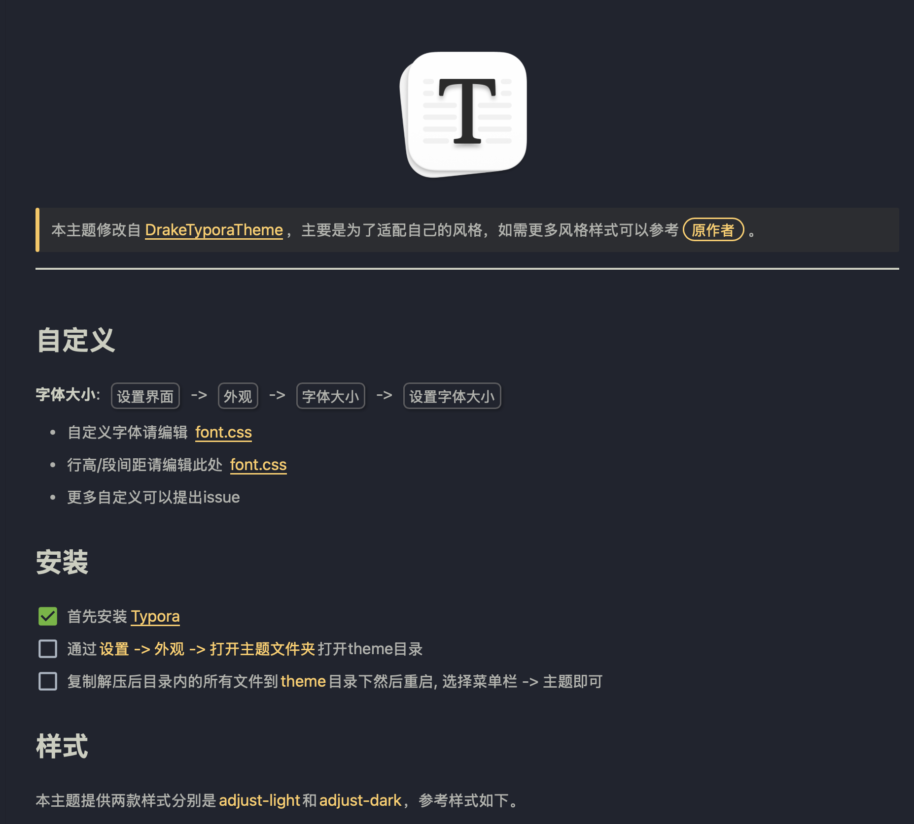

  

> 本主题修改自[DrakeTyporaTheme](https://github.com/liangjingkanji/DrakeTyporaTheme)，主要是为了适配自己的风格，如需更多风格样式可以参考==原作者==。

## 自定义

**字体大小**: <kbd>设置界面</kbd> -> <kbd>外观</kbd> -> <kbd>字体大小</kbd> -> <kbd>设置字体大小</kbd>

- 自定义字体请编辑 [font.css](https://github.com/JayHrn/typora-theme-adjust/blob/master/adjust/font.css#L39-L45)
- 行高/段间距请编辑此处 [font.css](https://github.com/JayHrn/typora-theme-adjust/blob/master/adjust/font.css#L47-L49)
- 更多自定义可以提出issue

## 安装

- [x] 首先安装[Typora](https://typora.io/)

- [ ] 通过`设置 -> 外观 -> 打开主题文件夹`打开theme目录
- [ ] 复制解压后目录内的所有文件到`theme`目录下然后重启, 选择菜单栏 -> 主题即可

## 样式

本主题提供两款样式分别是`adjust-light`和`adjust-dark`，参考样式如下。

| 主题名称     |                           预览图                            |
| :----------- | :---------------------------------------------------------: |
| adjust-light |  |
| adjust-dark  |  |