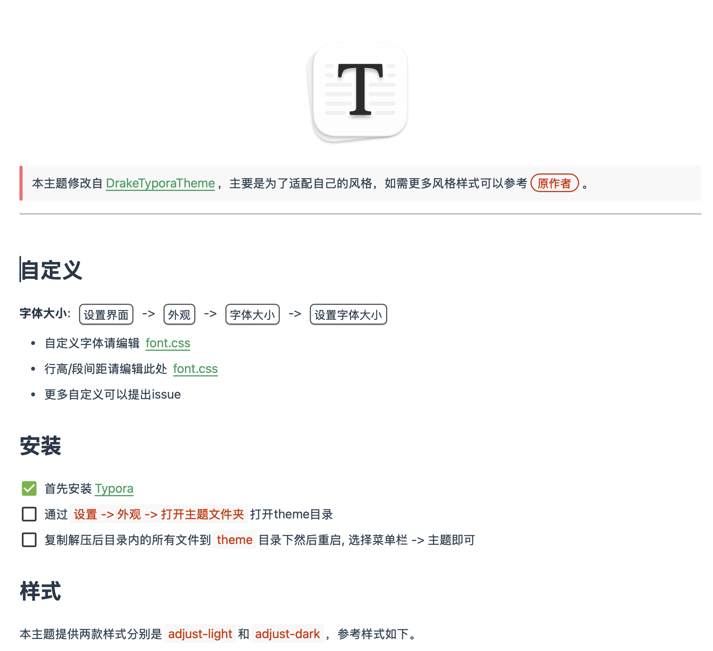

  <a title="中文" href="/README.md">中文</a>

  

> This theme is modified from [DrakeTyporaTheme](https://github.com/liangjingkanji/DrakeTyporaTheme), mainly to fit my personal style. For more style options, please refer to the original author.

## Customization

**Font Size**: <kbd>Settings</kbd> -> <kbd>Appearance</kbd> -> <kbd>Font Size</kbd> -> <kbd>Set Font Size</kbd>

- For custom fonts, edit [font.css](https://github.com/JayHrn/typora-theme-adjust/blob/master/adjust/font.css#L39-L45)
- For line height/paragraph spacing, edit [font.css](https://github.com/JayHrn/typora-theme-adjust/blob/master/adjust/font.css#L47-L49)
- For more customizations, please open an issue.

## Installation

- [x] First, install [Typora](https://typora.io/)

- [ ] Open the theme directory via `Settings -> Appearance -> Open Theme Folder`
- [ ] Copy all files from the extracted directory into the `theme` directory and restart. Then, choose the theme from the menu bar.

## Styles

This theme provides two styles: `adjust-light` and `adjust-dark`. Preview images are as follows.

| Theme Name   |                           Preview Image                            |
| :----------- | :------------------------------------------------------------: |
| adjust-light |  |
| adjust-dark  |  |
